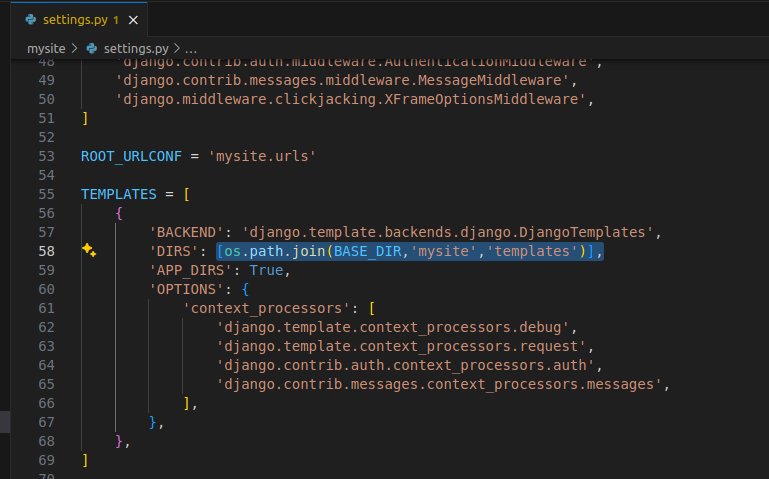
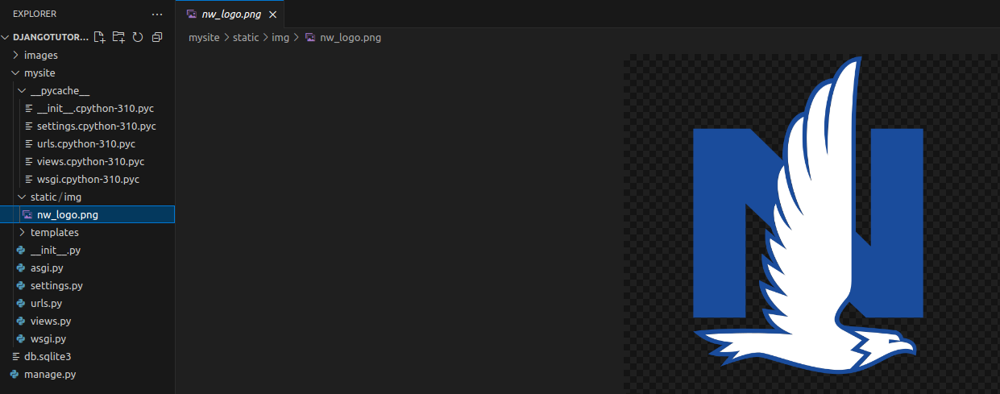
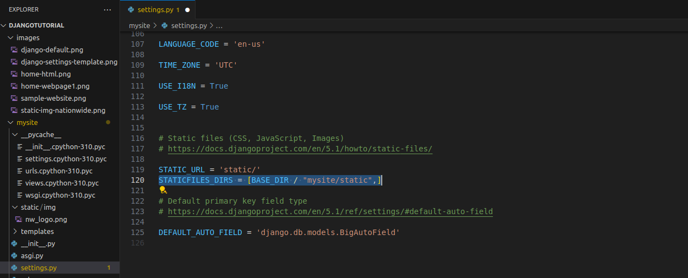
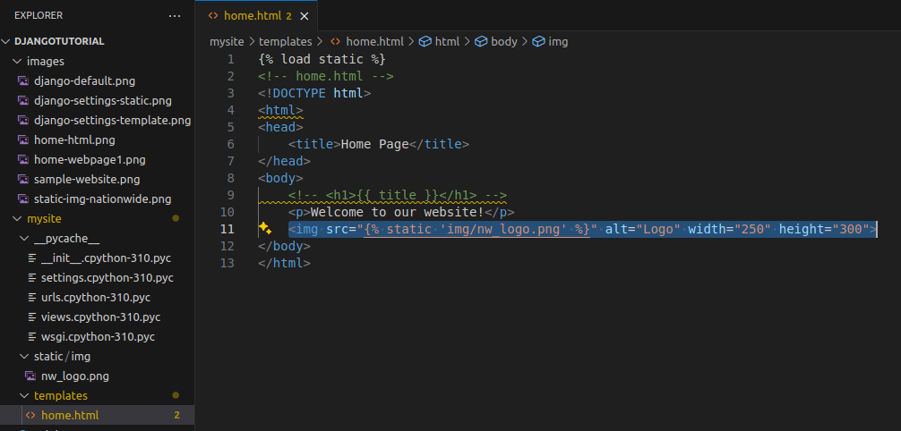

# Create Your Own Website!

We will be leveraging Python and a web framework called [Django](https://www.djangoproject.com/) to create a simple website.


## Installing Django
First we need to install the django framework for Python using the terminal in the bottom of VSCode
```
pip install django
```

## Create the Django Project
We need to create a project directory
```
cd Desktop
mkdir django-tutorial
cd django-tutorial
django-admin startproject mysite django-tutorial
```

## Open your project in VSCode
We are now ready to open our project:
1. Select File (top left menu)
2. Open Folder
3. Select Desktop
4. Click project folder (django-tutorial)
5. Click Open

Your project should look like:
```
django-tutorial/
   manage.py
   mysite/
      __init__.py
      settings.py
      urls.py
      wsgi.py
```
Let's take a look at what each of these files is doing:
- **manage.py** - Command line utility lets you interact with your Django project.

- **\_\_init\_\_.py** –  a blank Python script whose presence indicates to the Python interpreter that the directory is a Python package.

- **settings.py** – Contains the configuration settings for the Django project.

- **urls.py** – Contains URL patterns for the Django project.

- **wsgi.py** – Contains WSGI configuration properties for the Django project.

## Testing our Application
We are now ready to start our web application for the first time!
```
python manage.py runserver 8080
```
This will start the Django's built-in server now open your preferred browser and navigate to this address http://127.0.0.1:8080/ 

if everything went well you should see the default Django's welcome page.


## Adding Our First Page!
We will create a basic home page for our application to open using simple HTML.
1. Inside the mysite folder, create a new folder called *templates*
2. Inside the templates folder, create a new file called *home.html*

   
3. Inside the file, add the following code
   ```
   <!-- home.html -->
   <!DOCTYPE html>
   <html>
   <head>
       <title>Home Page</title>
   </head>
   <body>
       <p>Welcome to our website!</p>
   </body>
   </html>
   ```
4. In order for to load our web pages, we need to tell it where our web pages are located. Open *settings.py*

   a. At the very top of the file add the following code to access the operating system module
      ```
      import os
      ```
   b. Scroll down to the TEMPLATES block. Find the DIRS section add the following code setting the path to our templates folder
     ```
      os.path.join(BASE_DIR,'mysite','templates')
     ```
     The code should look like this:

      
5. Now we need to setup where the page will load from. Navigate to the *urls.py* file.
6. In the urlpatterns, add the following path:
   ```
   path('', views.home)
   ```
7. Finally we need to create a homepage view. Navigate to the *views.py* file.
8. Delete all the existing code and replace with:
   ```
   from django.shortcuts import render
   
   
   def home(request):
       return render(request, 'home.html')
   ```
9. Refresh the web browser and we should have our basic home page working!
   ]


##Customizing our site!
The basic site is working, but it looks a little boring. Lets add a picture!
1. Like the templates, we will need a place to store our images for our website. Inside the mysite folder, create a folder called *static*
2. Inside the static folder, create a folder called *img* (short for images)
3. Save your favorite picture inside of this folder using a simple file name (rename if necessary). For this example we used the Nationwide Logo.

   
4. Again, we need to tell Django where to look for images we want to include on our page. Go back to *settings.py*
5. Scroll down to the bottom to find the Static Files section. We currently have a STATIC_URL path defined. We need to add a STATICFILES_DIRS telling Django where the images are. Add the following code:
   ```
   STATICFILES_DIRS = [BASE_DIR / "mysite/static",]
   ```
      
6. Finally, we can add our image to our page! Return to your *home.html* page under templates.
   a. At the very top, we need to tell the page we are bring in static content. Add the following code:
      ```
      
      ```
   b. Below our welcome text, we are going to add the image code using our image file:
      ```
      
      ```
   
7. Refresh your webpage and you should have your new image showing up!

   


##Congratulations!!
You now have a simple working webpage. From here on out, your options are endless. Perhaps add more pages, or continue customizing the existing page?
